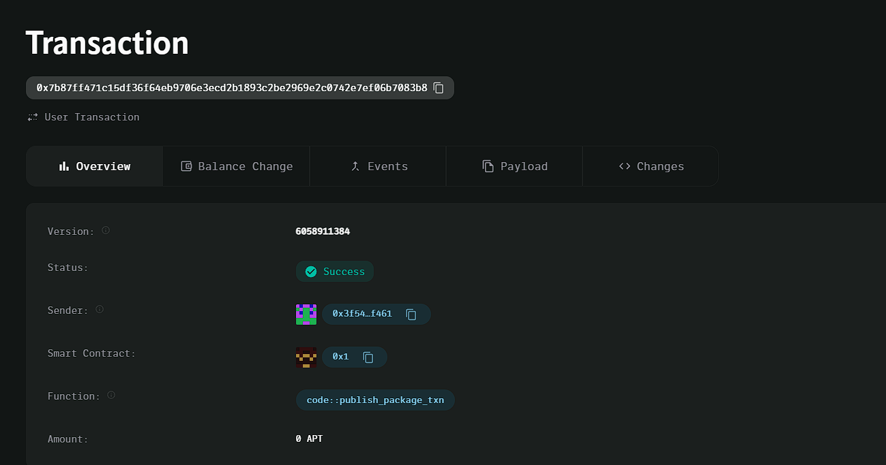

### Deployed smartcontract address: 0x7b87ff471c15df36f64eb9706e3ecd2b1893c2be2969e2c0742e7ef06b7083b8

### Screenshot: 

# Blockchain-based Digital Ticketing System

## Project Title
Blockchain-based Digital Ticketing System

## Project Description
The Blockchain-based Digital Ticketing System allows event organizers to issue digital tickets as NFTs on the blockchain. This system ensures ticket authenticity, prevents fraud, and enables easy resale, all while keeping a transparent, verifiable record of ticket ownership.

## Vision
Our vision is to revolutionize the event ticketing process by utilizing blockchain technology to ensure transparency, security, and authenticity. By issuing tickets as NFTs, we allow for seamless resale and verification of ownership, eliminating the problem of counterfeit tickets.

## Key Features
- **NFT-based Ticketing**: Event organizers can issue tickets as NFTs, ensuring uniqueness and ownership rights.
- **Ticket Resale**: Ticket holders can transfer ownership, allowing for easy and secure resale of tickets.
- **Authentication**: Tickets are verifiable on the blockchain, ensuring authenticity and preventing fraud.
- **Transparent Ownership**: The ownership of tickets is recorded on-chain, making the transfer history transparent and immutable.

## Future Scope
- **Dynamic Pricing**: Implement dynamic pricing for tickets based on demand and event proximity.
- **Royalty on Resale**: Enable event organizers to receive a royalty each time a ticket is resold.
- **Secondary Marketplace**: Create a decentralized marketplace for users to buy and resell event tickets.
- **Multi-event Support**: Allow organizers to manage multiple events and ticket types through the platform.
- **VIP and Access Control**: Use smart contracts to control access levels for VIP, general admission, and other types of tickets.

